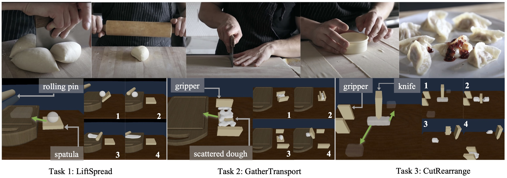

# DiffSkill
07/30 Release three diffskill environments LiftSpread, GatherMove, CutRearrange. Code on algorithms will be released very soon!

### Prerequsite
1. Install conda environments according to `environment.yml`, and then run `conda activate plb`.
2. Install [torch (1.9.0) with cudatoolkit (10.2)](https://pytorch.org/get-started/previous-versions/)
3. Install [pykeops (1.5)](https://www.kernel-operations.io/keops/python/installation.html); make sure version==1.5
3. Install [geomloss](https://www.kernel-operations.io/geomloss/api/install.html)
4. Run `./prepare.sh`
5. Download and unzip initial and target configurations of environmetns from [[Google Drive link for datasets (2G)]](https://drive.google.com/file/d/11XZw-p2FX-yvoHMnc_yNO5x7iiLxwlwB/view?usp=sharing)

### Environments
<figure>

</figure>

| LiftSpread  | GatherMove | CutRearrange |
| :---: | :---: | :---: |
|   |   |   |


The red line shows the normalized performance, while the green line shows the success threshold of the task. There are 3 environments for evaluation:

* **LiftSpread**: The agent needs to first use a spatula (modeled as a thin surface) to lift a dough onto the cutting board and then adopt a rolling pin to roll over the dough to flatten it. The rolling pin is simulated as a 3-Dof capsule that can rotate along the long axis and the vertical axis and translate along the vertical axis to press the dough.
* **GatherMove**: Initially, residual of dough is scattered over the table. First, the agent needs to gather the dough with an extended parallel gripper and place it on top of a spatula. Then the agent needs to use the spatula to transport the dough onto the cutting board. The spatula can translate and rotate along the vertical plane. The gripper can translate along the horizontal plane, rotate
around its center and open or close the gripper.
* **CutRearrange**:  This is a three-step task. Given an initial pile of dough, the agent needs to first cut the dough in half using a knife. Inspired by the recent cutting simulation (Heiden et al., 2021), we model the knife using a thin surface as the body and a prism as the blade. Next, the agent needs to use the gripper to transport each piece of the cut dough to target locations.

To test the environment, run `python scripts/random_env.py --env_name {env_name}`, where `env_name` can be from {LiftSpread-v1, GatherMove-v1, CutRearrange-v1}.

## Cite
If you find this codebase useful in your research, please consider citing:
```
@inproceedings{lin2022diffskill,
title={DiffSkill: Skill Abstraction from Differentiable Physics for Deformable Object Manipulations with Tools},
author={Xingyu Lin and Zhiao Huang and Yunzhu Li and Joshua B. Tenenbaum and David Held and Chuang Gan},
booktitle={International Conference on Learning Representations},
year={2022},
url={https://openreview.net/forum?id=Kef8cKdHWpP}}
}
```
